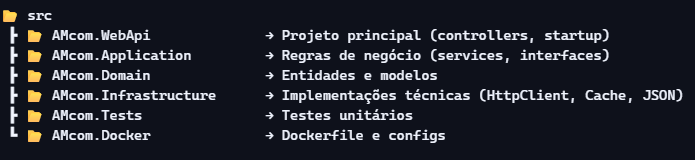

# DesafioAMcom

Durante esse Desafio, através do teste técnico você será avaliado nos seguintes requisitos:

- Conhecimento Linguagem Programação C#;
- Princípios S.O.L.I.D e Clean Code;
- Habilidade de escrever testes unitários;
- Capacidade de identificar e resolver problemas;
- Refatoração de código;

Para atender o nosso cliente precisamos resolver alguns problemas e desenvolver novas funcionalidades na aplicação atual.
O aplicativo é uma WebAPI desenvolvida em .NET 5 e estamos com problemas para identificar falhas na API e ao salvar as temperaturas erros estão acontecendo.

1)	Retornar a lista de países como origem o arquivo ‘países.json’ e disponibilizar as informações em um endpoint.
2)	Verificar o Controller de Temperaturas e verificar itens para serem melhorados e consertados.
3)	Cálculos de temperaturas já existentes não precisam ser mais calculados, devem ser armazenados (cache) e retornar o cálculo.
4)	Retornar dados da API https://reqres.in/api/users?page=2 e aplicar filtros para buscar pessoas por email e/ou nome.
5)	Documente os endpoints no Swagger
6)	Implemente Polly para Requests Http.
7)	Publique seu código em um repositório 😊
8)	Crie uma imagem Docker do seu aplicativo e publique lá no Docker Hub.

